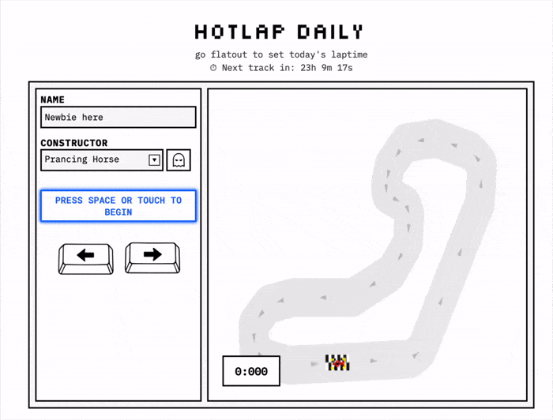

# Hotlap Daily

[](package.json)
[](https://hotlapdaily.com)
[](https://discord.com/invite/hSCtAbgcKY)
[](https://x.com/hotlapdaily)
[](https://www.instagram.com/hotlapdaily/)

Community driven racing game with new tracks everyday! Check your score live
on the leaderboard.

A daily browser racing game. Each day a new procedurally‑generated F1‑style
track goes live; players set the fastest lap they can and submit it to a global
leaderboard.



## Quick start

```bash
npm install
npm run dev        # http://localhost:3000
```

That's it. The game is fully playable, and lap submissions / leaderboards work
against an in‑memory database that (optionally) persists to `./.data/`.

## Commands

```bash
npm run dev          # Dev server on :3000
npm run build        # Production build
npm run start        # Run the production build
npm run lint         # ESLint

# Database (only needed if you opt into PostgreSQL)
npm run db:push      # Push the Prisma schema to your DB
npm run db:studio    # Prisma Studio GUI
```

## Persistence: in‑memory by default, Postgres optional

The data layer is pluggable (see [`src/lib/prisma.ts`](src/lib/prisma.ts)):

| `DB_BACKEND` | When                                | Notes                                                                       |
|--------------|-------------------------------------|-----------------------------------------------------------------------------|
| `memory`     | default (no `DATABASE_URL`)         | Zero setup. Persists to `./.data/hotlap-db.json` unless `DB_PERSIST=false`. |
| `postgres`   | default when `DATABASE_URL` is set  | Prisma + PostgreSQL. Run `npm run db:push` to create the schema.            |

Every API route imports a single `prisma` client; the backend is chosen at
runtime, so route code is identical regardless of which store is active.

To use Postgres:

```bash
cp env.example .env
# set DATABASE_URL=... in .env
npm run db:push
npm run dev
```

See [`env.example`](env.example) for all configuration (admin password,
anti‑cheat secret, etc.). **No secrets are required to run locally.**

## How it plays

- A track is selected per UTC day. The client can generate tracks entirely on
  its own (see `public/game/tracks/`), so the game works even with an empty
  database — it falls back to a built‑in track.
- Complete a clean lap; an anti‑cheat layer validates it client‑side, then the
  server re‑validates (proof‑of‑work + HMAC + physics constants) before the
  time is accepted.
- Times feed a global leaderboard and per‑track leaderboards. You can race
  against a "ghost" replay of a previous fast lap.

## Project layout

```
src/                      Next.js app (server shell + API routes)
  app/                    Pages and /api routes
  lib/                    Server libraries
    prisma.ts             Pluggable data client (memory | postgres)
    db/memoryClient.ts    Zero‑setup in‑memory backend
    trackGenerator.ts     Procedural track generation (track generator page)
    trackValidator.ts     Server‑side track/lap validation
public/game/              Client‑side game engine (static ES modules)
  engine.js               The Game orchestrator + game loop
  physics/                Car physics + input controller
  render/                 Canvas drawing + colors
  anticheat/              Client‑side checkpoint/line‑crossing validation
  net/                    API client + telemetry
  tracks/                 Track generator functions
  ui/                     HUD, leaderboard, share card
  util/                   Pure helpers (geometry)
prisma/                   Prisma schema (PostgreSQL)
```

See [ARCHITECTURE.md](ARCHITECTURE.md) for the full design, data flow, and
anti‑cheat details.

## License

Released under the [MIT License](LICENSE).
